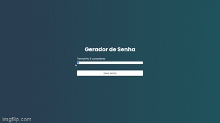

# Password-generator 🔑
<blockquote>

Meu primeiro projeto utilizando HTML, CSS e Javascript, o foco foi entender e fixar os estudos sobre estilização em CSS, manipulação do DOM e utilizar o método Math
   em Javascript.📗 🖊️

</blockquote>

    Nesse projeto, o usuário através do slider caracteres escolhe o tamanho da senha que deseja, que vai do tamanho 5 ao 20. Para gerar a senha basta clicar no botão e ela será mostrada. Há uma opção de copiar a senha passando o cursor e clicando no campo da senha.

<blockquote>
      
 Um pequeno preview do projeto :

</blockquote>

 
 
 ### 💻 Tecnologias Utilizadas
 
  

  
  
